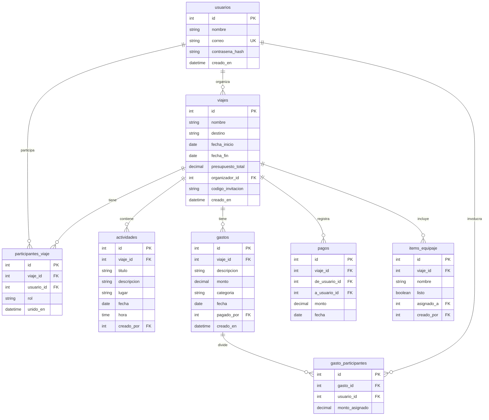

```mermaid
erDiagram
    usuarios ||--o{ viajes : "organiza"
    usuarios ||--o{ participantes_viaje : "participa"
    viajes ||--o{ participantes_viaje : "tiene"
    viajes ||--o{ actividades : "contiene"
    viajes ||--o{ gastos : "tiene"
    gastos ||--o{ gasto_participantes : "divide"
    usuarios ||--o{ gasto_participantes : "involucra"
    viajes ||--o{ pagos : "registra"
    viajes ||--o{ items_equipaje : "incluye"

    usuarios {
        int id PK
        string nombre
        string correo UK
        string contrasena_hash
        datetime creado_en
    }

    viajes {
        int id PK
        string nombre
        string destino
        date fecha_inicio
        date fecha_fin
        decimal presupuesto_total
        int organizador_id FK
        string codigo_invitacion
        datetime creado_en
    }

    participantes_viaje {
        int id PK
        int viaje_id FK
        int usuario_id FK
        string rol
        datetime unido_en
    }

    actividades {
        int id PK
        int viaje_id FK
        string titulo
        string descripcion
        string lugar
        date fecha
        time hora
        int creado_por FK
    }

    gastos {
        int id PK
        int viaje_id FK
        string descripcion
        decimal monto
        string categoria
        date fecha
        int pagado_por FK
        datetime creado_en
    }

    gasto_participantes {
        int id PK
        int gasto_id FK
        int usuario_id FK
        decimal monto_asignado
    }

    pagos {
        int id PK
        int viaje_id FK
        int de_usuario_id FK
        int a_usuario_id FK
        decimal monto
        date fecha
    }

    items_equipaje {
        int id PK
        int viaje_id FK
        string nombre
        boolean listo
        int asignado_a FK
        int creado_por FK
    }
```